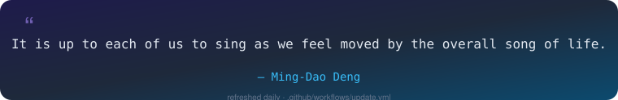

<!--
  ============================================================================
  Abhimanyu1311 / Abhimanyu1311 — GitHub Profile README
  ============================================================================
  🔧 REPLACE-ME CHECKLIST (search the file for these tokens):
    - Abhimanyu1311        → your GitHub username (already correct if this repo
                              is named exactly like your GitHub username)
    - your-linkedin        → your LinkedIn handle (linkedin.com/in/your-linkedin)
    - your-portfolio.com   → your live portfolio URL
    - your-twitter-handle  → your X / Twitter handle
    - your-email@domain.com→ the email you want public
  See SETUP.md for the full walkthrough (secrets, workflows, theming).
  ============================================================================
-->

<div align="center">

<!-- ANIMATED HEADER BANNER — capsule-render, dark-theme safe (has its own fill) -->


<!-- TYPING ANIMATION — dark/light aware via <picture> -->
<picture>
  <source media="(prefers-color-scheme: dark)" srcset="https://readme-typing-svg.demolab.com?font=Fira+Code&size=22&duration=2600&pause=900&color=A78BFA&background=00000000&center=true&vCenter=true&multiline=false&width=760&height=50&lines=Full+Stack+Developer;Backend+Engineer;Node.js+Developer;NestJS+Developer;TypeScript+Enthusiast;Building+Scalable+APIs;Cloud+Native+Developer;AI+Integration+Engineer;Learning+Generative+AI" />
  <source media="(prefers-color-scheme: light)" srcset="https://readme-typing-svg.demolab.com?font=Fira+Code&size=22&duration=2600&pause=900&color=4C1D95&background=00000000&center=true&vCenter=true&multiline=false&width=760&height=50&lines=Full+Stack+Developer;Backend+Engineer;Node.js+Developer;NestJS+Developer;TypeScript+Enthusiast;Building+Scalable+APIs;Cloud+Native+Developer;AI+Integration+Engineer;Learning+Generative+AI" />
  
</picture>

<!-- 🔧 REPLACE the profile links below with your own -->

[](https://github.com/Abhimanyu1311)
[](https://www.linkedin.com/in/abhimanyu-saini-850037280)
<!-- [](https://your-portfolio.com) -->
[](https://mail.google.com/mail/?view=cm&fs=1&to=abhimanyusaini2001@gmail.com)


</div>


## 👋 About Me

I'm **Abhimanyu Saini**, a **Full Stack Developer (Backend Focused)** with **2+ years** of experience building scalable backend systems, REST APIs, cloud-integrated applications, and AI-powered products. Based in **Mohali, Punjab, India** 🇮🇳.

I specialize in **Node.js, NestJS, TypeScript, PostgreSQL, Sequelize, Redis, Docker, REST APIs, AWS**, and **AI integrations** — designing systems that are production-ready, well-typed, and built to scale.

- 🏗️ Designing scalable backend architectures
- 🔌 Building production-ready APIs
- 🌐 Learning distributed systems
- 🤖 Exploring Generative AI
- 🌱 Contributing to open source


## 🛠️ Tech Stack

<div align="center">

**Backend**
<br/>


**Frontend**
<br/>


**Databases**
<br/>


**Cloud & DevOps**
<br/>


**Developer Tools**
<br/>


<br/>

**ORMs & Authentication** &nbsp;<sub>(not covered by skillicons.dev)</sub>
<br/>


**PM2 · Swagger · Project Management**
<br/>


**AI & LLM**
<br/>


</div>


## 📚 Currently Learning

<div align="center">

<picture>
  <source media="(prefers-color-scheme: dark)" srcset="https://readme-typing-svg.demolab.com?font=Fira+Code&size=18&duration=2400&pause=800&color=38BDF8&background=00000000&center=true&vCenter=true&width=700&height=40&lines=Generative+AI;Retrieval-Augmented+Generation+(RAG);AI+Agents;LLM+Engineering;Distributed+Systems;System+Design;Cloud+Architecture" />
  <source media="(prefers-color-scheme: light)" srcset="https://readme-typing-svg.demolab.com?font=Fira+Code&size=18&duration=2400&pause=800&color=0369A1&background=00000000&center=true&vCenter=true&width=700&height=40&lines=Generative+AI;Retrieval-Augmented+Generation+(RAG);AI+Agents;LLM+Engineering;Distributed+Systems;System+Design;Cloud+Architecture" />
  
</picture>


</div>


## 💼 Work Experience

<table width="100%">
<tr>
<td>

### Full Stack Developer — **Genboot Private Limited**

Working across the stack with a strong backend focus, delivering production-grade systems:

- 🔧 Backend Development — Node.js / NestJS services powering core products
- 🔌 REST APIs — designing and maintaining type-safe, documented APIs
- ☁️ Cloud Services — deploying and operating AWS-backed infrastructure
- 🤖 AI Integration — embedding LLM-powered features into real products
- 🏗️ Scalable Architectures — building systems designed to grow
- 🌐 Full Stack Development — end-to-end ownership from DB to UI

</td>
</tr>
</table>


## 🚀 Featured Projects

<table width="100%">
<tr>
<td width="50%" valign="top">

###  Nearby Vibes


- Automated venue onboarding using Google Places API
- Secure account deletion using transactional database operations
- Email verification & password reset workflows
- Type-safe API architecture
- Robust validation using `class-validator`
- Scalable REST APIs on PostgreSQL & Sequelize
- Full authentication & authorization
- Production-ready backend architecture

</td>
<td width="50%" valign="top">

###  Cloudquarks


- Microservices architecture
- Product catalog APIs
- Subscription management
- Order APIs
- Payment workflows
- Background processing using Python

</td>
</tr>
<tr>
<td width="50%" valign="top">

###  Sydkik


- Admin dashboard & analytics
- HelpScout integration
- Role-Based Access Control (RBAC)
- Real-time notifications
- Chat system

</td>
<td width="50%" valign="top">

###  Klaviss


- REST APIs & document automation
- LLM-powered workflows
- Property data extraction from PDFs
- Prompt engineering
- Multi-model AI integration (OpenAI, Gemini, Claude)

</td>
</tr>
</table>

<!-- 📌 HOW TO ADD FUTURE PROJECTS: copy a <td> block above and edit the title,
     badges, and bullet list. Keep the 2-column <table> structure so cards stay aligned. -->


## 📊 GitHub Stats

<div align="center">

<picture>
  <source media="(prefers-color-scheme: dark)" srcset="https://github-readme-stats.vercel.app/api?username=Abhimanyu1311&show_icons=true&theme=tokyonight&hide_border=true&count_private=true&include_all_commits=true" />
  <source media="(prefers-color-scheme: light)" srcset="https://github-readme-stats.vercel.app/api?username=Abhimanyu1311&show_icons=true&theme=default&hide_border=true&count_private=true&include_all_commits=true" />
  
</picture>
<picture>
  <source media="(prefers-color-scheme: dark)" srcset="https://github-readme-stats.vercel.app/api/top-langs/?username=Abhimanyu1311&layout=compact&theme=tokyonight&hide_border=true&langs_count=10" />
  <source media="(prefers-color-scheme: light)" srcset="https://github-readme-stats.vercel.app/api/top-langs/?username=Abhimanyu1311&layout=compact&theme=default&hide_border=true&langs_count=10" />
  
</picture>

<picture>
  <source media="(prefers-color-scheme: dark)" srcset="https://github-readme-streak-stats.herokuapp.com/?user=Abhimanyu1311&theme=tokyonight&hide_border=true" />
  <source media="(prefers-color-scheme: light)" srcset="https://github-readme-streak-stats.herokuapp.com/?user=Abhimanyu1311&theme=default&hide_border=true" />
  
</picture>

<picture>
  <source media="(prefers-color-scheme: dark)" srcset="https://github-readme-activity-graph.vercel.app/graph?username=Abhimanyu1311&theme=tokyo-night&hide_border=true&area=true" />
  <source media="(prefers-color-scheme: light)" srcset="https://github-readme-activity-graph.vercel.app/graph?username=Abhimanyu1311&theme=minimal&hide_border=true&area=true" />
  
</picture>

<br/><br/>


</div>


## 🐍 Contribution Snake

<div align="center">

<!-- Generated daily by .github/workflows/snake.yml → pushed to the `output` branch -->
<picture>
  <source media="(prefers-color-scheme: dark)" srcset="https://raw.githubusercontent.com/Abhimanyu1311/Abhimanyu1311/output/github-contribution-grid-snake-dark.svg" />
  <source media="(prefers-color-scheme: light)" srcset="https://raw.githubusercontent.com/Abhimanyu1311/Abhimanyu1311/output/github-contribution-grid-snake.svg" />
  
</picture>

<sub>⚠️ Renders after the <code>snake.yml</code> workflow runs at least once — see <a href="SETUP.md">SETUP.md</a>.</sub>

</div>


## 📈 GitHub Metrics

<div align="center">

<!-- Generated by .github/workflows/metrics.yml → committed to assets/metrics.svg -->


<sub>⚠️ Renders after the <code>metrics.yml</code> workflow runs at least once — see <a href="SETUP.md">SETUP.md</a>.</sub>

</div>


## 🏆 Trophies

<div align="center">

<picture>
  <source media="(prefers-color-scheme: dark)" srcset="https://github-profile-trophy.vercel.app/?username=Abhimanyu1311&theme=tokyonight&no-frame=true&row=1&column=7&margin-w=8" />
  <source media="(prefers-color-scheme: light)" srcset="https://github-profile-trophy.vercel.app/?username=Abhimanyu1311&theme=flat&no-frame=true&row=1&column=7&margin-w=8" />
  
</picture>

</div>


## 💬 Random Dev Quote

<div align="center">

<!-- Refreshed daily by .github/workflows/update.yml -->


</div>


## 🎯 Fun Facts

<div align="center">

|                          |                         |                               |
| :----------------------: | :---------------------: | :---------------------------: |
| ☕ **Powered by Coffee** |  🚀 **Backend First**   |      🧠 **AI Explorer**       |
|   ⚡ **API Craftsman**   | 📚 **Lifelong Learner** | 🌍 **Open Source Enthusiast** |

</div>


## 🎯 Current Focus

<div align="center">

<table>
<tr><td>

```text
const currentFocus = {
  scalable   : "Backend Development",
  ai         : "AI-Powered Applications",
  design     : "System Design",
  cloud      : "Cloud Architecture",
  apis       : "High Performance APIs",
  community  : "Open Source Contributions",
};
```

</td></tr>
</table>

</div>


## 🤝 Connect With Me

<div align="center">

<!-- 🔧 REPLACE all four links below with your real profiles -->

[](https://github.com/Abhimanyu1311)
[](https://www.linkedin.com/in/abhimanyu-saini-850037280/)
[](https://mail.google.com/mail/?view=cm&fs=1&to=abhimanyusaini2001@gmail.com)
<!-- [](https://your-portfolio.com) -->
<!-- [](https://x.com/your-twitter-handle) -->

</div>


<div align="center">
<sub>⭐ If you found this profile inspiring, consider starring some of my repositories. Thanks for stopping by!</sub>
</div>
